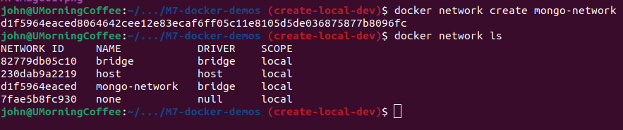
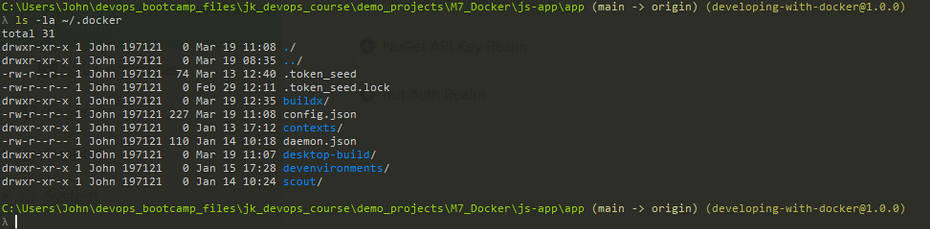
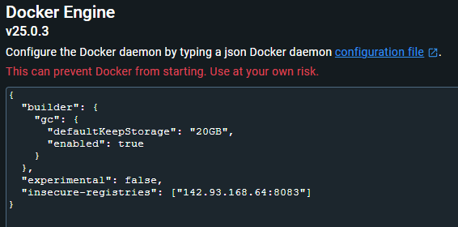
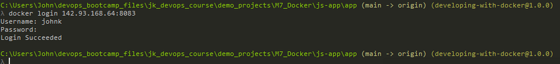

Demo Project:
Deploy Nexus as Docker container
Technologies used:

- Docker, Nexus, DigitalOcean, Linux

Project Description:

1.  Create and Configure Droplet
2.  Set up and run Nexus as a Docker container
----------------------------------------------------------------------------------------------------

1.  1st we create a new droplet (regular ssd ($48 pm), ubuntu, use the ssh key for this main pc, and addit to the same firewall rules as last time - change the name as it's got the same name as the previous one)
2.  we only need docker running on this server, everything else will be inside the container
3.  obvs run and update & upgrade by running the below:

```bash
apt update -y && apt upgrade -y
```

4. Install docker, running below:

```bash
snap install docker
```

5. head to docker hub and search for nexus3


6. scrolling down the documentation, we need to take a look at persistent data, run the below:

```bash
docker volume create --name nexus-data
```

then:
```bash
docker run -d -p 8081:8081 --name nexus -v nexus-data:/nexus-data sonatype/nexus3
```

7. running netstat we can see Nexus running on 8081 (needed to install net-tools) 



8. we can see the same querying docker
9. we can now also open the servers ip in a browser and see Nexus ui is running
10. In the nexus module, we created a nexus user (best practices)
11. so we'll run exec and shell in
    when we shell in we see the nexus user is already created for us
    Opening Nexus3 tags on Docker hub, we can see the image layers, and if we scroll down to the bottom we can see the nexus user was created

12. running docker insepct [volume name] we can see more information, location, scope etc

```bash
docker inspect nexus-data
```



13. we can also see by changing to that dir we can see the temp admin password



14. we can see the same data from the root of the server 


