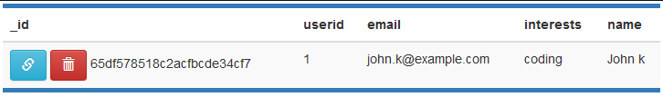

# M7-Docker-demos
Use Docker for local development
Technologies used:

- Docker, Node.js, MongoDB, MongoExpress

Project Description:

1.  Create Dockerfile for Nodejs application and build Docker image
2.  Run Nodejs application in Docker container and connect to MongoDB database container locally.
3.  Also run MongoExpress container as a UI of the MongoDB database.

------------------------------------------------------------------------------------------------------

1. Pull MongoDB & Mongo Express images

```bash
docker pull mongo
docker pull mongo-express
```


2. create mongo network

```bash
docker network create mongo-network
```


3. run mongo & connect to the mongo network

```bash
docker run -p 27017:27017 -d -e MONGO_INITDB_ROOT_USERNAME=admin -e MONGO_INITDB_ROOT_PASSWORD=password --name mongodb --net mongo-network mongo
```


4. Now we start mongoexpress, same as before we look at the doc on it via docker hub [here](https://hub.docker.com/_/mongo-express) (we also add the mongo-network variable so we can connect it)

```bash
docker run -d \
-p 8081:8081 \
-e ME_CONFIG_MONGODB_ADMINUSERNAME=admin \
-e ME_CONFIG_MONGODB_ADMINPASSWORD=password \
--net mongo-network \
--name mongo-express \
-e ME_CONFIG_MONGODB_SERVER=mongodb \
mongo-express
```


*had an issue where "password" didnt work, till I shortened it to pass....*

5. from the Mongro-express UI, we create a new DB called "user-account"
6. now we connect to the db from the nodeJS app
7. we open the server.js file in intellij (ensure the connection info is correct)
8. cd to the app/ and run it

```bash
npm ci
npm server.js
```

9. access localhost:3000


10. update the info



11. go to localhost:8080 to see the data in the db

**We have a fully functioning NodeJS app, which has persistant data in a MongoDB w/ MongoUI all of which running in a docker Container**
