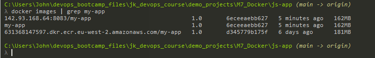

Demo Project:
Dockerize Nodejs application and push to private Docker registry
Technologies used:

-  Docker, Node.js, Amazon ECR

Project Description:

1. Write Dockerfile to build a Docker image for a Nodejs application
2. Create private Docker registry on AWS (Amazon ECR)
3. Push Docker image to this private repository

--------------------------------------------------------------------------------------------

1. We will create a Dockerfile based on the mongo.yaml file we created previously

```dockerfile
FROM node:20-alpine

ENV MONGO_DB_USERNAME=admin \
    MONGO_DB_PWD=password

RUN mkdir -p /home/app

COPY ./app /home/app

# no need for /home/app/server.js because of WORKDIR
CMD ["node", "server.js"]
```

2. with the Dockerfile created, we open terminal from inside the project folder, and run:

```bash
# -t what we call the image, plus using the : we give it a version number
# then we give the location of the Dockerfile, because we are executing from inside the project folder, we can just type
# .
docker build -t my-app:1.0 .
```


*From above, you can see the build steps [1/3]-[3/3]*

3. when we run docker images we can see our newly created image


4. We have just done what Jenkins would do (if we had it running)
5. After the image is built, you would push it to a repo
6. when we run the container we get an error (which makes sense seeing as we didnt tell it where to run)
7. we add two lines between the COPY commadn and the CMD command, as below:

```bash
# set default dir so that next commands executes in /home/app dir
WORKDIR /home/app
# will execute npm install in /home/app because of WORKDIR
RUN npm install
```


4. you can get into the container by running the exec command as below:

```bash
docker exec -it <container ID> /bin/sh
```

5. we are going to recreate the Dockerfile, making it more efficient (basically removing the files we dont need to copy over)



