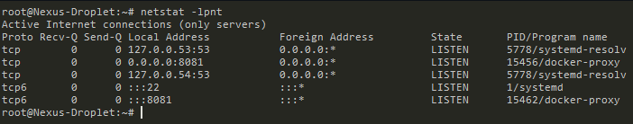
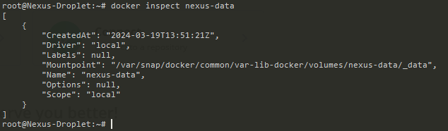

Demo Project:
Deploy Docker application on a server with Docker Compose
Technologies used:

- Docker, Amazon ECR, Node.js, MongoDB, MongoExpress

Project Description:

1. Copy Docker-compose file to remote server
2. Login to private Docker registry on remote server to fetch our app image
3. Start our application container with MongoDB and MongoExpress services using docker compose

--------------------------------------------------------------------------------------------------------------------------

1. Create a private repo for Docker
2. login to aws console > open ecr
3. click get started
4. we call name it after the app (my-app), leave everything as default
5. 631368147597.dkr.ecr.eu-west-2.amazonaws.com/my-app
   NOTE: ECR is a single repo per image 

6. connect & login to ECR from local terminal
7. click "view push commands" gives you line by line what needs to be executed 

8. Now we will make some changes to the App, rebuild & push a new version to AWS repo

    (remember, re-auth with ecr (if you have shut your terminal down previously))
    docker build -t my-app:1.0 .
    update the tags w/ (docker tag my-app:1.0 631368147597.dkr.ecr.eu-west-2.amazonaws.com/my-app:1.0)
    and push to ecr (docker push 631368147597.dkr.ecr.eu-west-2.amazonaws.com/my-app:1.0)

9. we then start all 3x containers locally (probably to test to see it works) - running docker-compose -f mongo.yaml up

