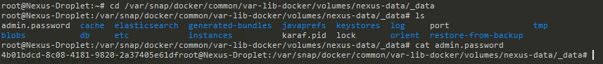
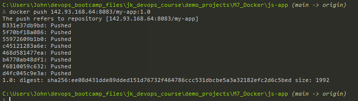

Demo Project:
Create Docker repository on Nexus and push to it
Technologies used:

- Docker, Nexus, DigitalOcean, Linux

Project Description:

1. Create Docker hosted repository on Nexus
2. Create Docker repository role on Nexus
3. Configure Nexus, DigitalOcean Droplet and Docker to be able to push to Docker repository
4. Build and Push Docker image to Docker repository on Nexus

--------------------------------------------------------------------------------------------------

1. we create a new repo on Nexus, under a "docker (hosted)" and call it "docker-hosted" leave all the fields as default 


2. the above image shows us the url we can use to push images to the repo

    http://142.93.168.64:8081/repository/docker-hosted/

3. now we create a docker role for this
4. create role > "nexus role" > name it "nx-docker" > for privileges, we use the "nx-repository-view-docker-docker-hosted-*" > save
5. next we assign it to our existing user "johnk"
6. before we can get push to nexus we need to make some changes to the docker repo, we open the repo, and edit the "HTTP" (Create an HTTP connector at specified port. Normally used if the server is behind a secure proxy.). the reason for this is because docker cannot use the nexus URL endpoint for docker login, this is down to the port that nexus is running on. So we need a port for docker repo specifically
7. on the nexus/docker-repo there's a tool tip for "repostory connectors" "Connectors allow Docker clients to connect directly to hosted registries, but are not always required. Consult our documentation for which connector is appropriate for your use case. For information on scaling the repositories see our scaling documentation."
8. we set this to 8083 which is different from the nexus port
9. if we run the netstat command on the droplet we can see it's been opened, we also need to open it on the firewall to allows us to 


*access it / push to it*

10. we also need to configure a "realm" within Nexus, this is a type of token used for authentication from nexus docker repo for a client, and that will be stored locally on my machine saved inside "config.json" inside the .docker folder 


11. anytime we push or pull from the nexus repo, this token will be used
12. we click the "docker bearer token realm" & save
13. by default Docker only allows client requests to HTTPs endpoints of a docker registry, because we dont have this, we need to make some changes
14. Using Windows Docker Desktop, go to settings > Docker Engine and add "insecure-registries" line, as below:

```bash
  "insecure-registries": ["142.93.168.64:8083"]
```



*apple & restart the engine*

15. head to the teminal and run docker login, as below:

```bash
docker login 142.93.168.64:8083
```

16. this will ask for the nexus user & password 


17. Time to push images to Nexus Repo
18. We start off by building an image from the js-app folder, by running

```bash
docker build -t my-app:1.0 .
```

19.  we retag that image, to include the address of the Nexus Repo
        Previously we didn't do this, as by default it pushes to our Docker Repo
20. we run the below command with the new tag:

```bash
 docker tag my-app:1.0 142.93.168.64:8083/my-app:1.0
```

21. the above, implicitly tells docker where to push
22. when I run docker images, we can see the new image (w/ the Nexus repo) 


23. now we run:

```bash
docker push 142.93.168.64:8083/my-app:1.0
```



24. And on the repo we can see the image:


