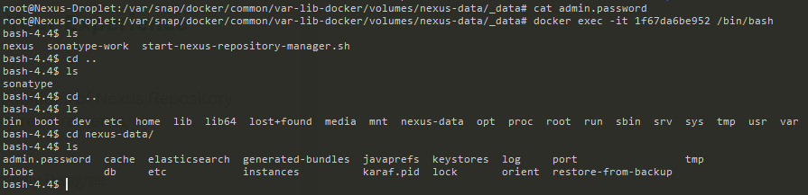

Demo Project:
Persist data with Docker Volumes
Technologies used:

- Docker, Node.js, MongoDB

Project Description:

1. Persist data of a MongoDB container by attaching a Docker volume to it

----------------------------------------------------------------------------------------------------------

1. from inside the pp folder we run the following:

```bash
docker-compose -f docker-compose.yaml up
```

*this starts up mongo & mongo-express, and we create a database called "user-accounts" and a collection called "users" (as below) [the DB & collection are variables within the nodejs app]*


2. if we recreate the container we lose all this data, now we will create a compose file that uses named volumes
3. we being by adding named volumes to our compose file, as below:

```dockerfile
version: '3'
services:
  mongodb:
    image: mongo
    ports:
      - 27017:27017
    environment:
      - MONGO_INITDB_ROOT_USERNAME=admin
      - MONGO_INITDB_ROOT_PASSWORD=password
    volumes:
      - mongo-data:/data/db
  mongo-express:
    image: mongo-express
    ports:
    - 8081:8081
    restart: always
    environment:
      - ME_CONFIG_MONGODB_ADMINUSERNAME=admin
      - ME_CONFIG_MONGODB_ADMINPASSWORD=pass
      - ME_CONFIG_MONGODB_SERVER=mongodb
volumes:
  mongo-data:
    driver: local
```

*the rules set forth for the location of data is described on mongo DB docs page here NOTE: Always check docs for DBs data locations as they all differ (though SQL & Postgres loc's are the same /var/lib/data) we can verify this by sh'ing into the container running the exec command and viewing the location *


4. the above will be destroyed when we recreate the data (obvs)

    during container replication, all the data saved locally will replicate to the container
    we now restart the compose command
    running "docker-compose -f mongo.yaml down" removes:
        Containers for services defined in the Compose file.
        networks
        etc
    we restart the containers and as before all the data is replicated

5. So where is the data located locally?

    this will differ on OSs:
        Windows: c:\programdata\docker\volumes
        Linux: var/lib/docker/volumes
        Mac: var/lib/docker/volumes
    each volumes has it's hash then /_data we can run the below to view the data about the containers:

```bash
docker run -it --privileged --pid=host debian nsenter -t 1 -m -u -n -i sh
```



6. the volumes shown as "b3b5ef4ae37a3683f53dc6c4aeef05a760811de63ceaade75f09f74b439f53e4" etc are known as "anonymous volumes" as we explained earlier
7. if we access the contaienrs volume using the exec command and look inside the /data/db folder we will see the exact same data listed from the docker run -it --privileged ... command


